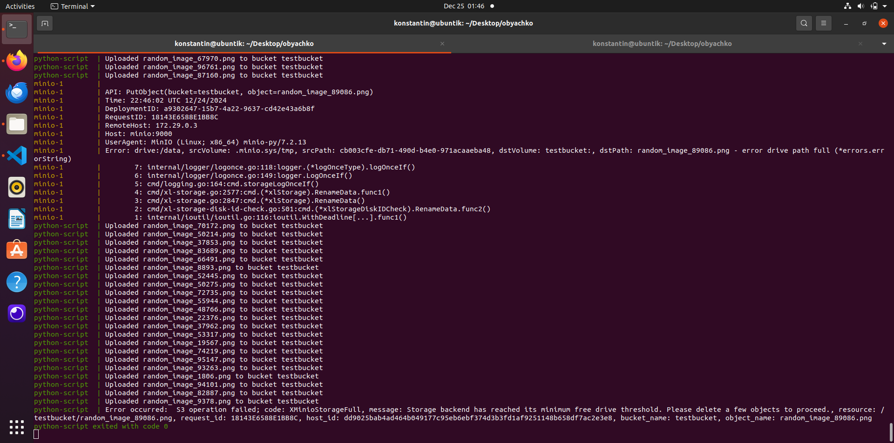
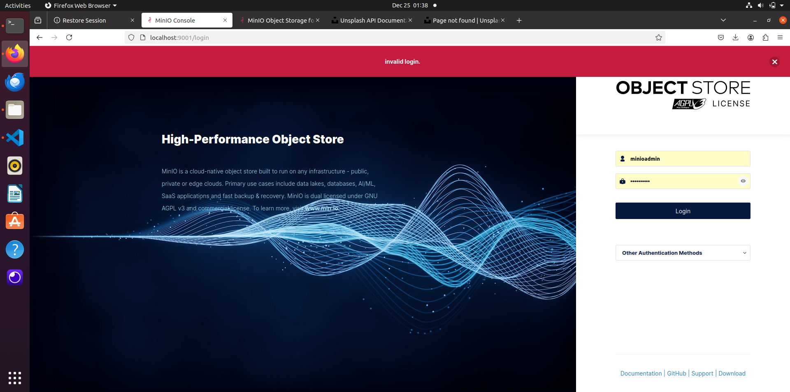
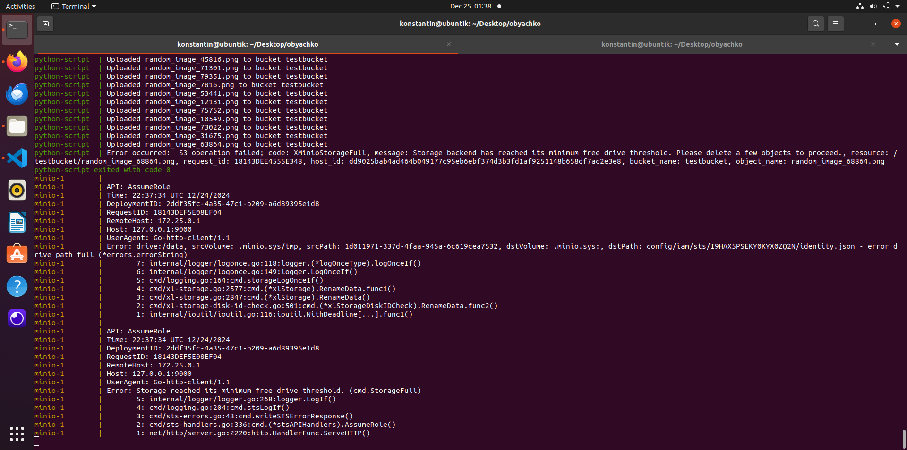

To launch the project, run the following command:
```
docker compose up
```
Even if the hard limits are set, Minios buckets still let users to put objects there.
Minio loads more than possible due to the fact that the scanner does not have time to realize that the limit has been exceeded.
If you try to upload a file larger than the size of the package, it will immediately give an error.

In my case, files were uploading so fast that Minio didnt realize that all the container's memory was used.(see pic below)


Container still has some memory to function and if we'll to log in to Minio, we'll get the following error:



And on the client we ll see why we got such an error:
